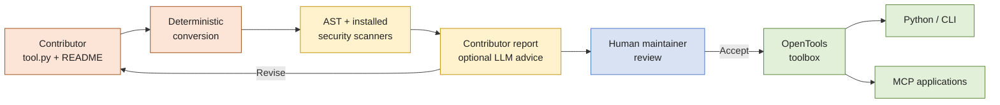

# 🛠️🧰 OpenTools: Open, Reliable, and Collective: A Community-Driven Framework for Tool-Using AI Agents

[](https://github.com/hydang99/opentools)
[](https://huggingface.co/spaces/opentools/opentools)


**OpenTools** is a community-driven framework for building, evaluating, and deploying tools for tool-integrated language models. It treats end-to-end agent performance as a combination of **tool-use accuracy** (selecting/calling tools correctly) and **intrinsic tool accuracy** (tools staying correct and stable as APIs and environments drift). To support both, OpenTools provides a **Tool Accuracy / Maintenance Loop** for repeatable evaluation and maintainer-reviewed updates, and an **Agentic Workflow** for integrating curated tool collections into LLM agents. The project emphasizes standardized tool schemas, community feedback, separation between tools and agent policies, and transparent execution evidence.

---

## ✨ Latest Updates

> [!UPDATES]
> **📰 July 2026 update:** OpenTools now supports a review-oriented path
> from an open-source Python function to a standardized contribution bundle,
> risk evidence, maintainer review, and controlled application access.

| Update | What it adds | Try it |
|---|---|---|
| 🧩 **Tool conversion** | Convert a documented, typed Python function into a standardized wrapper and tool card without executing it. | [`opentools convert-tool`](#5-convert-and-contribute-a-tool) |
| 🛡️ **Layered inspection** | Built-in AST analysis plus optional Gitleaks, detect-secrets, Bandit, and local Semgrep rules, with unavailable scanners reported explicitly. | [Inspect a tool](#2-inspect-and-evaluate-a-tool) |
| 🤖 **Advisory LLM review** | Review sanitized metadata and evidence for documentation, test evidence, output clarity, and maintainability. The judge cannot approve a tool or override risk findings. | [Run the opt-in judge](#2-inspect-and-evaluate-a-tool) |
| 🌐 **MCP access** | Discover, inspect, evaluate, and invoke registered tools from external applications through stdio or Streamable HTTP. | [Connect through MCP](#4-connect-an-application-through-mcp) |
| 👥 **Contributor WebUI** | Upload `tool.py` and a README, inspect findings, and download a pending-review bundle in the existing Hugging Face Space. | [Open the demo](https://huggingface.co/spaces/opentools/opentools) |
| 📋 **Manual maintenance** | Maintainers explicitly select evaluations, inspect generated changes, and refresh the shared inventory after review. | [Refresh the inventory](#3-refresh-evaluations-and-the-tool-inventory) |

### Review-oriented contribution workflow



The hosted contribution flow **does not import or execute uploaded code**.
Scanner and LLM outputs are review evidence, not a safety certification or an
automatic acceptance decision.

---

## What Is Included

- **Open-source tool framework:** `BaseTool`, registry, JSON parameter schemas,
  configuration, and model adapters.
- **Local evaluation:** non-executing source inspection, policy-gated existing
  tests, evidence reports, and an optional advisory LLM judge.
- **Layered risk inspection:** built-in AST checks plus optional Gitleaks,
  detect-secrets, Bandit, and repository-local Semgrep rules. Scanner failures
  and missing installations are reported explicitly.
- **Tool standardization:** deterministic conversion of a documented, annotated
  Python function into a reviewable OpenTools bundle without executing it.
- **Community maintenance:** generated tool cards and inventory tables that
  maintainers refresh explicitly after reviewing evaluation evidence.
- **Application access:** an MCP server supporting stdio and Streamable HTTP,
  with execution disabled by default and controlled by allowlists and risk policy.
- **Existing demonstration UI:** the OpenTools Hugging Face Space supports agent
  use, test-case feedback, and pending-review tool contributions.
- **Agents and benchmarks:** OpenTools, OctoTools, ReAct, Chain-of-Thought,
  Zero-Shot, the multi-agent runner, and benchmark datasets.

---

## Setup

Create a Python environment, install dependencies, and install OpenTools in editable mode.

### 1. Clone the repository

Fork the repo on GitHub, then clone your fork:

```bash
git clone https://github.com/your-username/opentools.git
cd opentools
```

### 2. Create and activate a virtual environment

Example with conda:

```bash
conda create -n opentools python=3.11 -y
conda activate opentools
```

### 3. (Optional) Windows: install dependencies

On Windows, shell and dependency behavior can differ from macOS/Linux. If you're on Windows, run the provided script first (e.g. in Git Bash or WSL):

```bash
bash set_up_package_window.sh
```

### 4. Install OpenTools in editable mode

From the repo root:

```bash
pip install -e .
```

Install optional feature groups as needed:

```bash
# MCP server and client support
pip install -e '.[mcp]'

# Python security scanners: Bandit and detect-secrets
pip install -e '.[security]'
```

Semgrep is best installed as an isolated command-line application because some
Semgrep releases pin packages also used by MCP:

```bash
pipx install semgrep
```


## API Keys and Environment

OpenTools loads API keys from environment variables ending with `_API_KEY`. If `python-dotenv` is installed, `.env` files can be loaded automatically.

Example `.env`:

```env
OPENAI_API_KEY=your_openai_key
GOOGLE_API_KEY=your_google_key
...
```

CLI helpers for env setup:

```bash
opentools create-env-template
opentools load-env .env
```

## Tutorials

### 1. Discover and run a tool

List tools, inspect Calculator's tool card, and invoke the real implementation:

```bash
opentools list
opentools info Calculator_Tool
opentools run Calculator_Tool \
  --args '{"operation":"add","values":[1,2,3]}' \
  --json
```

The Calculator result should contain `"result": "6"` and `"success": true`.

### 2. Inspect and evaluate a tool

Run a static preflight before importing or executing a local tool:

```bash
opentools evaluate ./src/opentools/tools/calculator
```

Add the optional external scanners:

```bash
pip install -e '.[security]'
pipx install semgrep

# macOS; use the official Gitleaks installation instructions on other systems.
brew install gitleaks

opentools evaluate ./path/to/tool.py --external-scanners --json
```

The external report names each scanner as `completed`, `findings`, `failed`, or
`unavailable`; an absent scanner is never represented as a successful scan.
Gitleaks and detect-secrets cover secret formats, Bandit checks Python security
issues, and Semgrep uses the repository-local OpenTools ruleset. Findings omit
matched values, source snippets, and secret hashes.

The preflight reports observable network, credential, filesystem, subprocess, and
dynamic-execution signals. It is a review aid, not a security guarantee. Tool code
is executed only when explicitly requested:

```bash
opentools evaluate Calculator_Tool --run-tests --output evaluation-report.json
```

An optional LLM judge can review the tool card and observed evidence for
documentation quality, test adequacy, output-contract clarity, and
maintainability:

```bash
opentools evaluate Calculator_Tool --run-tests --judge --judge-model gpt-4o-mini
```

The judge is advisory, cannot override restricted preflight findings, and is not
used as a security certification. It runs only when a maintainer explicitly
passes `--judge`, avoiding unintended credential use, API costs, and
nondeterministic acceptance decisions. Invoking `--judge` sends selected tool
metadata and sanitized findings—but not source code, credential values, or
absolute local paths—to the configured model provider.

Restricted findings block test execution unless the user also passes
`--allow-risky`. Reports contain only observed test results; when a test routine
does not write structured evidence, OpenTools reports
`completed_without_structured_results` rather than inferring an accuracy.

Run the preflight and unit checks manually before reviewing a tool or refreshing
the shared inventory. This keeps execution, credentials, and result updates
under maintainer control.

### 3. Refresh evaluations and the tool inventory

`evaluation_index.json` is the canonical summary used by tool cards and the
generated table in `src/opentools/tools/readme.md`. Refresh both from existing
evidence without executing tools:

```bash
opentools update-inventory
```

Run real existing tests for an explicit low-risk set, update the index, and
regenerate the table:

```bash
opentools evaluate-all \
  --tools Calculator_Tool \
  --max-risk low \
  --discard-raw-results
```

Bulk execution requires `--tools` or the explicit `--all-eligible` flag.
Restricted tools are never eligible. Maintainers should review the generated
index and table diff before committing it. API and LLM tools require the
necessary credentials and should be evaluated deliberately with appropriate
cost controls.

### 4. Connect an application through MCP

OpenTools exposes the same inspection and evaluation layer through an MCP server:

```bash
opentools-mcp --transport stdio
```

The server provides four MCP tools: `list_opentools`, `inspect_opentool`,
`evaluate_opentool`, and `call_opentool`. It accepts registered tool names only and returns sanitized
evidence without source code, credential values, absolute paths, or result-file
paths. Listing, inspection, and tool-card extraction use AST parsing and do not
import submitted tool modules. Test execution is disabled by default.

Restrict the visible toolbox and explicitly enable tests when starting a trusted,
local server:

```bash
export OPENTOOLS_MCP_ALLOWED_TOOLS="Calculator_Tool,Search_Engine_Tool"
export OPENTOOLS_MCP_ALLOW_EXECUTION=1
export OPENTOOLS_MCP_ALLOW_TOOL_CALLS=1
export OPENTOOLS_MCP_MAX_RISK=low
opentools-mcp --transport stdio
```

Test execution and application tool calls have separate enable flags. Both
require an explicit allowlist; only the requested module is then imported.
Restricted tools remain blocked, and caution tools require the explicit
`OPENTOOLS_MCP_MAX_RISK=caution` policy. A generic MCP client configuration is:

```json
{
  "mcpServers": {
    "opentools": {
      "command": "opentools-mcp",
      "args": ["--transport", "stdio"],
      "env": {
        "OPENTOOLS_MCP_ALLOWED_TOOLS": "Calculator_Tool",
        "OPENTOOLS_MCP_ALLOW_TOOL_CALLS": "1",
        "OPENTOOLS_MCP_MAX_RISK": "low"
      }
    }
  }
}
```

For local development, Streamable HTTP is also available:

```bash
opentools-mcp \
  --transport streamable-http \
  --host 127.0.0.1 \
  --port 8000
```

Connect an MCP client to `http://127.0.0.1:8000/mcp`. Opening this endpoint in
an ordinary browser is not a protocol test; use an MCP SDK client or the runnable
MCP section of the notebook linked below. Do not expose an unauthenticated
development server publicly.

A minimal read-only container deployment exposing only the calculator is
included:

```bash
docker compose -f docker-compose.mcp.yml up --build
```

The Streamable HTTP endpoint is available at `http://localhost:8000/mcp`.
Extend the image with a tool's dependencies before adding that tool to the
allowlist. Authentication and TLS must be added at the deployment boundary before
public hosting.

### 5. Convert and contribute a tool

Convert a README plus an annotated Python function into a reviewable OpenTools
bundle:

```bash
opentools convert-tool submitted.py \
  --readme README.md \
  --name "My Tool" \
  --entrypoint run_my_tool \
  --license Apache-2.0 \
  --output opentools_contributions
```

The converter infers a JSON parameter schema from supported type annotations,
preserves the submitted source, generates a `BaseTool` wrapper, and performs
static risk inspection, including redacted checks for possible hardcoded
credentials. It does **not** execute submitted code or report a
functional score. Unsupported or ambiguous entrypoints fail with an explicit
error rather than guessed behavior.

The existing [OpenTools Hugging Face Space](https://huggingface.co/spaces/opentools/opentools)
provides the equivalent **Contribute Tools** flow within the main demonstration
UI. Users upload `tool.py` and a README, review risk and metadata findings, and
download a contribution bundle. An optional LLM review evaluates sanitized
metadata and evidence only. Web submissions remain
`pending_maintainer_review`; they are never merged or executed automatically.

To test the existing Space locally as a separate checkout:

```bash
git clone https://huggingface.co/spaces/opentools/opentools opentools-space
cd opentools-space
pip install -r requirements.txt
python -m unittest discover -s tests -p "test_*.py" -v
python app.py
```

Open `http://127.0.0.1:7860`, then use **Contribute Tools** to upload a Python
file and README. The returned report should show the generated tool card,
conversion status, built-in risk findings, per-scanner statuses, and
`functional_evaluation.status: not_run`.

An executable notebook covering static inspection, inventory generation,
conversion, MCP invocation, and the opt-in real
LLM judge is available at
[`docs/demo/4_evaluation_mcp_contribution.ipynb`](docs/demo/4_evaluation_mcp_contribution.ipynb).

### 6. Verify the revision features

Run the main suite from the repository root:

```bash
PYTHONPATH=src python -m unittest discover -s tests -p "test_*.py" -v
```

Run the real external-scanner integration test separately:

```bash
PYTHONPATH=src python -m unittest discover \
  -s tests \
  -p "test_external_scanners.py" \
  -v
```

The scanner test creates temporary synthetic risky input, invokes only scanners
that are actually installed, and verifies that suspected values are absent from
the serialized report. It does not substitute mocked scanner results.

---

OpenTools can be used in two ways: **from the CLI** (direct command-line interface) or **inside a Python environment** (import and call from your code). Both modes use the same tools and agents.

### Using OpenTools in Python

**Tools** — load the registry, list tools, and run a tool:

```python
from opentools import load_all_tools, list_available_tools, create_tool

load_all_tools()
print(list_available_tools())

tool = create_tool("Calculator_Tool")
result = tool.run(operation="add", values=[1, 2, 3])
print(result)
```

**Agents** — use `UnifiedSolver` to run an agent:

```python
from opentools import UnifiedSolver

solver = UnifiedSolver(agent_name="opentools", llm_engine_name="gpt-4o-mini")
result = solver.solve(question="What is 2 + 2?")
print(result.get("direct_output") or result.get("final_output"))
```

### Using OpenTools from the CLI

Run tools and inspect metadata directly from the terminal:

```bash
opentools list
opentools info Calculator_Tool
opentools reload
```

--- 
## Documentation Structure

- **[`docs/`](./docs/)**: High-level guides and runnable examples for users and contributors.
  - **[`docs/demo/`](./docs/demo/)**: Jupyter notebooks that demonstrate how to run agents and tools  
    (e.g., [`2_agent_running.ipynb`](./docs/demo/2_agent_running.ipynb), [`3_agent_running_with_tool_retrieval.ipynb`](./docs/demo/3_agent_running_with_tool_retrieval.ipynb), [`1_tool_running.ipynb`](./docs/demo/1_tool_running.ipynb)).
  - **Top-level docs files** (e.g., [`2_AGENT_RUNNING.md`](./docs/2_AGENT_RUNNING.md), [`1_TOOL_RUNNING.md`](./docs/1_TOOL_RUNNING.md), [`3_CONTRIBUTION.md`](./docs/3_CONTRIBUTION.md)): walk through how the system works, how to run the demos, and how to contribute or extend OpenTools.
  - If you are unsure where to start, open the markdown files in [`docs/`](./docs/)—they contain step-by-step instructions and background explanations.


- **[`src/`](./src/)**: Source code and in-code documentation.
  - **[`src/opentools/`](./src/opentools/)**: Main Python package that powers everything in this repo.
    - **[`core/`](./src/opentools/core/)**: Config, base classes, and core orchestration logic.
    - **[`tools/`](./src/opentools/tools/)**: Built-in tools, each usually documented by a local `README.md`.
    - **[`models/`](./src/opentools/models/)**: Model and LLM engine integrations.
    - **[`agents/`](./src/opentools/agents/)**: Agent definitions and orchestrators (e.g., the unified solver).
    - **[`Benchmark/`](./src/opentools/Benchmark/)**: Benchmark runners and datasets (e.g., VQAv2) with their own `README.md` files and assets.
  - For deeper technical details, see the `README.md` files inside each subfolder and the inline docstrings/comments in the code.

## Contributing

For how to run things and contribute in practice, start with the docs:

- [`docs/3_CONTRIBUTION.md`](./docs/3_CONTRIBUTION.md): overview of contribution guidelines and how work typically flows in this repo.
- [`docs/demo/`](./docs/demo/) notebooks (e.g., [`2_agent_running.ipynb`](./docs/demo/2_agent_running.ipynb), [`1_TOOL_RUNNING.ipynb`](./docs/demo/1_TOOL_RUNNING.ipynb), [`3_agent_running_with_tool_retrieval.ipynb`](./docs/demo/3_agent_running_with_tool_retrieval.ipynb)): step-by-step, executable demos that show how the pieces fit together.

## License

Apache License 2.0. See [`LICENSE`](./LICENSE).

## Support

- Issues: https://github.com/hydang99/opentools/issues
